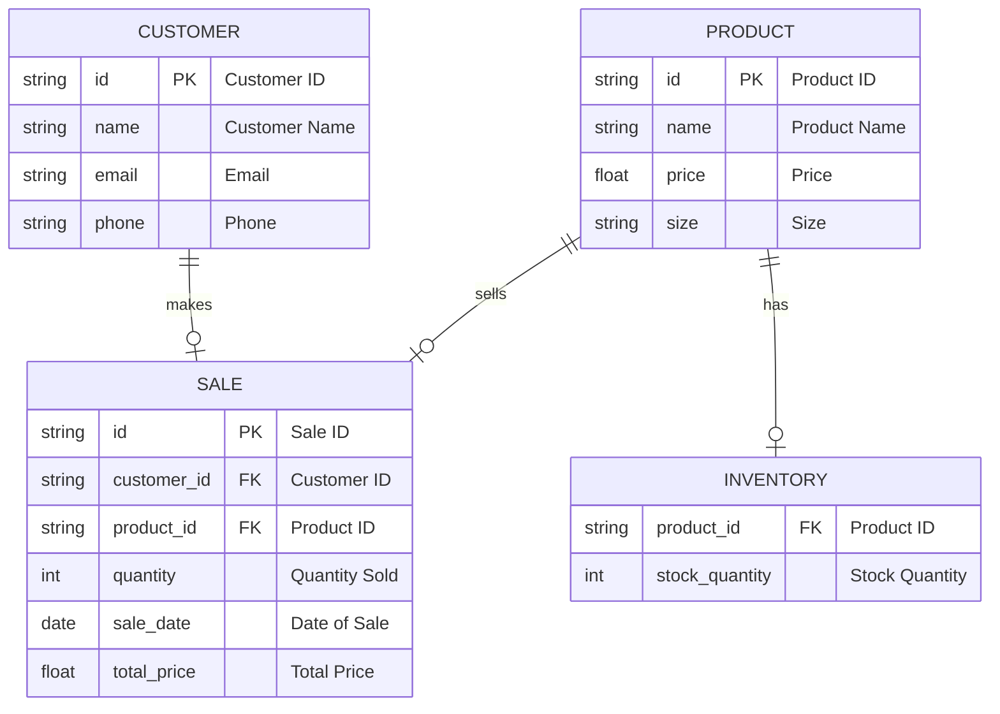

1. Customer to Sale: A customer can make many sales, so it's a one-to-many relationship.
2. Product to Sale: A product can be sold in many sales, so it's a one-to-many relationship.
3. Product to Inventory: Each product has one inventory record, so it's a one-to-one relationship.
4. Sale to Product and Customer: Each sale involves one product and one customer.
